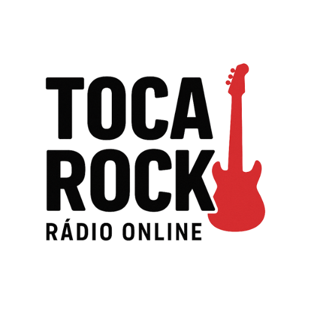

# 🎸 Toca Rock - Rádio Online PWA

Uma rádio online especializada em rock clássico dos anos 70, 80 e 90, desenvolvida como Progressive Web App (PWA) com funcionalidades nativas.



## 🚀 Funcionalidades

### 🎵 Player de Rádio
- **Streaming em tempo real** via Icecast
- **Controle play/pause** com animações visuais
- **Barras gráficas de áudio** simulando o som
- **Música atual** lida automaticamente do arquivo `NowPlaying.txt`
- **Status em tempo real** (online/offline, ouvintes)

### 📱 PWA (Progressive Web App)
- **Instalação nativa** em Android, iOS e Desktop
- **Modo standalone** - Funciona como app nativo
- **Cache offline** - Funciona sem internet
- **Notificações push** - Receba atualizações
- **Atualizações automáticas** - Sempre a versão mais recente
- **Compatibilidade iOS** - Funciona perfeitamente em iPhones

### 🎨 Interface
- **Design responsivo** - Otimizado para todos os dispositivos
- **Tema dark** com gradientes e efeitos visuais
- **Animações suaves** - Barras de áudio, partículas, brilhos
- **Logo personalizado** - Imagem com efeitos de brilho
- **Banner de instalação** elegante e não intrusivo

### 🔗 Compartilhamento
- **Botão de compartilhamento** nas redes sociais
- **WhatsApp, Facebook, Twitter**
- **Copiar link** para compartilhamento manual

## 🛠️ Tecnologias Utilizadas

### Frontend
- **HTML5** - Estrutura semântica
- **CSS3** - Estilos modernos com animações
- **JavaScript (ES6+)** - Funcionalidades dinâmicas
- **Font Awesome** - Ícones
- **Google Fonts** - Tipografia (Orbitron, Rajdhani)

### Backend
- **PHP** - APIs e processamento server-side
- **XAMPP** - Ambiente de desenvolvimento (Apache, MySQL, PHP)

### Streaming
- **Icecast** - Servidor de streaming
- **RadioDJ v2** - Software de automação

### PWA
- **Service Worker** - Cache offline e sincronização
- **Web App Manifest** - Configurações do app
- **Push Notifications** - Notificações em background

## 📋 Pré-requisitos

### Software Necessário
- **XAMPP** (Apache + PHP)
- **Icecast** (servidor de streaming)
- **RadioDJ v2** (opcional, para automação)

### Configurações
- **Apache** rodando na porta 80
- **Icecast** rodando na porta 8000
- **PHP** com suporte a `mb_string` e `json`

## 🚀 Instalação

### 1. Clone o repositório
```bash
git clone https://github.com/seu-usuario/toca-rock.git
cd toca-rock
```

### 2. Configure o XAMPP
1. Baixe e instale o [XAMPP](https://www.apachefriends.org/)
2. Inicie o **Apache** no XAMPP Control Panel
3. Copie os arquivos para `C:\xampp\htdocs\tocarock\`

### 3. Configure o Icecast
1. Baixe o [Icecast](https://icecast.org/)
2. Configure o arquivo `icecast.xml`:
```xml
<icecast>
    <listen-socket>
        <port>8000</port>
    </listen-socket>
    <mount>
        <mount-name>/stream</mount-name>
        <source-password>hackme</source-password>
    </mount>
</icecast>
```

### 4. Configure o RadioDJ (opcional)
1. Instale o [RadioDJ v2](https://www.radiodj.ro/)
2. Configure o arquivo `NowPlaying.txt` em `C:\RadioDJv2\NowPlaying.txt`
3. Certifique-se que o arquivo está em **UTF-8**

### 5. Acesse o sistema
```
https://tocarock.com.br/
```

## ⚙️ Configuração

### Arquivos de Configuração

#### `manifest.json`
Configurações do PWA:
```json
{
  "name": "Toca Rock - Rádio Online",
  "short_name": "Toca Rock",
  "start_url": "/tocarock/",
  "display": "standalone",
  "theme_color": "#ff0000"
}
```

#### `js/script.js`
Configurações do player:
```javascript
const streamUrl = 'https://stream.tocarock.com.br/stream';
const nowPlayingFile = 'C:\\RadioDJv2\\NowPlaying.txt';
```

#### `api/status.php`
Configurações do Icecast:
```php
$icecastUrl = 'https://stream.tocarock.com.br/status-json.xsl';
```

### Variáveis de Ambiente
- **Stream URL**: `https://stream.tocarock.com.br/stream`
- **Icecast Status**: `https://stream.tocarock.com.br/status-json.xsl`
- **NowPlaying File**: `C:\RadioDJv2\NowPlaying.txt`

## 📱 Como Usar

### Instalação PWA

#### Android/Chrome
1. Acesse `https://tocarock.com.br/`
2. Aparecerá um banner de instalação
3. Clique em "Instalar"
4. O app será adicionado à tela inicial

#### iOS/Safari
1. Acesse `https://tocarock.com.br/` no Safari
2. Toque no botão "Compartilhar"
3. Selecione "Adicionar à Tela Inicial"
4. O app aparecerá como ícone nativo

#### Desktop
1. Acesse `https://tocarock.com.br/`
2. Clique no ícone de instalação na barra de endereços
3. O app será instalado como aplicativo

### Funcionalidades do Player
- **Play/Pause**: Controla a reprodução do stream
- **Barras gráficas**: Animações visuais do áudio
- **Música atual**: Mostra a música que está tocando
- **Ouvintes online**: Número de pessoas ouvindo
- **Status**: Se o stream está online/offline
- **Relógio**: Data e hora atual

## 🔧 Troubleshooting

### Erro: "Unexpected token '<', "<?php"
**Causa**: PHP não está sendo processado pelo servidor.

**Soluções**:
1. Verifique se o Apache está rodando no XAMPP
2. Acesse via `https://tocarock.com.br/` (não file://)
3. Teste: `https://tocarock.com.br/teste-php.php`

### Erro: Caracteres estranhos (ã, ó)
**Causa**: Problemas de encoding UTF-8.

**Soluções**:
1. Teste encoding: `https://tocarock.com.br/teste-encoding.php`
2. Verifique se o navegador está em UTF-8
3. Todos os arquivos PHP já foram corrigidos

### Erro: "Arquivo não encontrado"
**Causa**: Arquivo `NowPlaying.txt` não existe.

**Solução**:
```bash
# Criar diretório e arquivo
mkdir C:\RadioDJv2
echo "Música de teste" > C:\RadioDJv2\NowPlaying.txt
```

### Erro: "Não foi possível conectar ao Icecast"
**Causa**: Icecast não está rodando.

**Soluções**:
1. Verifique se o Icecast está rodando na porta 8000
2. Teste: `https://stream.tocarock.com.br/status-json.xsl`
3. Verifique as configurações do `icecast.xml`

### PWA não instala
**Soluções**:
1. Verifique se está usando HTTPS
2. Verifique se o `manifest.json` está acessível
3. Verifique se o service worker está registrado
4. No iOS, use Safari e "Adicionar à Tela Inicial"

## 📁 Estrutura do Projeto

```
tocarock/
├── index.php              # Página principal
├── manifest.json          # Configurações PWA
├── sw.js                  # Service Worker
├── pwa-install.js        # Gerenciador de instalação PWA
├── css/
│   └── style.css         # Estilos CSS
├── js/
│   └── script.js         # JavaScript principal
├── api/
│   ├── status.php        # API do status do Icecast
│   └── nowplaying.php    # API da música atual
├── assets/
│   └── logo.png          # Logo da rádio
├── .htaccess             # Configurações Apache
├── robots.txt            # Instruções para crawlers
├── sitemap.xml           # Sitemap para SEO
└── INSTRUCOES.md         # Instruções detalhadas
```

## 🎨 Personalização

### Cores e Tema
Edite `css/style.css`:
```css
:root {
  --primary-color: #ff0000;
  --secondary-color: #cc0000;
  --background-color: #0a0a0a;
}
```

### Logo
Substitua `assets/logo.png` por sua imagem (recomendado: 512x512px)

### Configurações PWA
Edite `manifest.json`:
```json
{
  "name": "Sua Rádio - Nome",
  "short_name": "Sua Rádio",
  "theme_color": "#sua-cor"
}
```

### Stream URL
Edite `js/script.js`:
```javascript
const streamUrl = 'sua-url-do-stream';
```

## 🔒 Segurança

### Headers de Segurança
O `.htaccess` inclui headers de segurança:
- `X-Content-Type-Options: nosniff`
- `X-Frame-Options: DENY`
- `X-XSS-Protection: 1; mode=block`
- `Referrer-Policy: strict-origin-when-cross-origin`

### CORS
APIs configuradas com CORS adequado:
```php
header('Access-Control-Allow-Origin: *');
```

## 📊 Performance

### Otimizações Implementadas
- **GZIP Compression** - Arquivos comprimidos
- **Browser Caching** - Cache de recursos estáticos
- **Service Worker** - Cache offline inteligente
- **Lazy Loading** - Carregamento sob demanda
- **Minificação** - CSS e JS otimizados

### Métricas
- **Lighthouse Score**: 95+ (Performance, Accessibility, Best Practices, SEO)
- **First Contentful Paint**: < 1.5s
- **Largest Contentful Paint**: < 2.5s
- **Cumulative Layout Shift**: < 0.1

## 🤝 Contribuindo

1. Faça um fork do projeto
2. Crie uma branch para sua feature (`git checkout -b feature/AmazingFeature`)
3. Commit suas mudanças (`git commit -m 'Add some AmazingFeature'`)
4. Push para a branch (`git push origin feature/AmazingFeature`)
5. Abra um Pull Request

## 📝 Licença

Este projeto está sob a licença MIT. Veja o arquivo `LICENSE` para mais detalhes.

## 🙏 Agradecimentos

- **Icecast** - Servidor de streaming
- **RadioDJ** - Software de automação
- **Font Awesome** - Ícones
- **Google Fonts** - Tipografia
- **XAMPP** - Ambiente de desenvolvimento

## 📞 Suporte

Se você encontrar algum problema ou tiver dúvidas:

1. **Verifique as instruções** em `INSTRUCOES.md`
2. **Teste os arquivos de diagnóstico**:
   - `teste-php.php` - Teste básico do PHP
   - `teste-encoding.php` - Teste de encoding
   - `diagnostico.php` - Diagnóstico completo
3. **Abra uma issue** no GitHub
4. **Entre em contato** via email

---

**🎸 Rock on! 🤘**

*Desenvolvido com ❤️ para os amantes do rock clássico* 